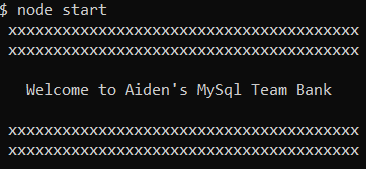

# MySQL Team Bank 
[](https://choosealicense.com/licenses/mit/)


    
## Description
**MySQL Team Bank** is a command-line application that allows the user to add, view & remove departments, roles and employees as well as update employee roles and managers. The user is also able to view employees by manager and view the total budget of each department.  

---

#### Table of Contents
- [Description](#description)
- [User Story](#user)
- [Installation](#installation)
- [Usage](#usage)
- [Demo](#demo)
- [Technologies Used](#technologies)
- [License](#license)
- [Questions](#questions)

---

### User Story

```
As a business owner
I want to be able to view and manage the departments, roles, and employees in my company
So that I can organize and plan my business
```

### Installation
Run ```npm install``` in your terminal


### Usage
Run ```npm start``` in your terminal to start the program. Then, select from the menu to begin building your team! See [Demo](#demo) for more info.


### Demo 

[** *Link to full demo.* **](https://youtu.be/zi5_UMX_N_A)

### Technologies Used
- Node.js
- InquirerJs
- Console-Table-Printer
- MySQL
- HeidiSQL

#### License
This project is licensed under MIT. 

#### Questions
    
If you have any questions, please [email me.](mailto:aiden.threadgoode@gmail.com)

If you'd like to see more of my work, feel free to check out [my github!](https://github.com/a-thread)

*© 2020 Aiden Threadgoode*
    